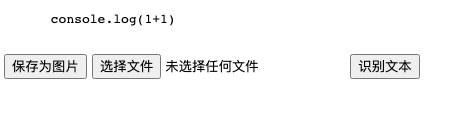
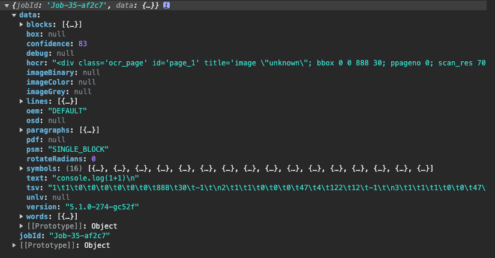
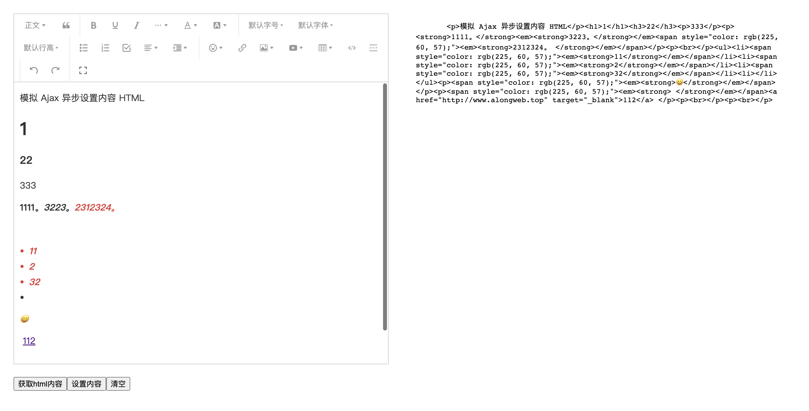

`一个案例，帮你解决一个问题，日常代码记录`

- [gulp-javascript-obfuscator(代码混淆)](#gulp-javascript-obfuscator)
- [canvas-javascript-url(图片识别)](#canvas-javascript-url)
- [wangEditor](#富文本编辑器使用)

# gulp-javascript-obfuscator

## 描述

此案例仅用于 html,css,js 文件压缩混淆，js 文件压缩支持密钥混淆.

## 使用教程

```js
  cd gulp-javascript-obfuscator
  pnpm i

  gulp
```

## 压缩结果对比

原 html

```html
<!--
 * @Author: along
 * @Description: html
 * @Date: 2023-06-29 21:34:20
 * @LastEditors: along
 * @LastEditTime: 2023-06-29 21:35:57
 * @FilePath: /cxy-case/gulp-javascript-obfuscator/tools/index.html
-->
<!DOCTYPE html>
<html lang="en">
  <head>
    <meta charset="UTF-8" />
    <meta name="viewport" content="width=device-width, initial-scale=1.0" />
    <link rel="stylesheet" href="./css/index.css" />
    <script src="./js//index.js"></script>
    <title>Document</title>
  </head>
  <body>
    <div>123</div>
  </body>
</html>
```

压缩后 html

```html
<!DOCTYPE html>
<html lang="en">
  <head>
    <meta charset="UTF-8" />
    <meta name="viewport" content="width=device-width,initial-scale=1" />
    <link rel="stylesheet" href="./css/index.css" />
    <script src="./js//index.js"></script>
    <title>Document</title>
  </head>
  <body>
    <div>123</div>
  </body>
</html>
```

原 css 代码

```css
* {
  margin: 0;
  padding: 0;
}
```

压缩后 css

```css
* {
  margin: 0;
  padding: 0;
}
```

原 js 代码

```js
let a = 1;
let b = 2;

console.log(a + b);
```

混淆后代码

```js
const _0xf15c04 = _0x187e;
(function (_0x396a13, _0x5ad26c) {
  const _0x28d0c2 = _0x187e,
    _0x5a47c5 = _0x396a13();
  while (!![]) {
    try {
      const _0x2f552b =
        parseInt(_0x28d0c2(0x1ad)) / 0x1 +
        (-parseInt(_0x28d0c2(0x1a5)) / 0x2) *
          (parseInt(_0x28d0c2(0x1a2)) / 0x3) +
        -parseInt(_0x28d0c2(0x1aa)) / 0x4 +
        -parseInt(_0x28d0c2(0x1af)) / 0x5 +
        parseInt(_0x28d0c2(0x1a9)) / 0x6 +
        -parseInt(_0x28d0c2(0x1a6)) / 0x7 +
        (-parseInt(_0x28d0c2(0x1ac)) / 0x8) *
          (-parseInt(_0x28d0c2(0x1a3)) / 0x9);
      if (_0x2f552b === _0x5ad26c) break;
      else _0x5a47c5['push'](_0x5a47c5['shift']());
    } catch (_0x105ff3) {
      _0x5a47c5['push'](_0x5a47c5['shift']());
    }
  }
})(_0x9158, 0xaab2b);
const _0xfb2da3 = (function () {
    let _0x15a21a = !![];
    return function (_0x302b0c, _0x2137c2) {
      const _0x15f07e = _0x15a21a
        ? function () {
            if (_0x2137c2) {
              const _0x4441b7 = _0x2137c2['apply'](_0x302b0c, arguments);
              return (_0x2137c2 = null), _0x4441b7;
            }
          }
        : function () {};
      return (_0x15a21a = ![]), _0x15f07e;
    };
  })(),
  _0x1eb508 = _0xfb2da3(this, function () {
    const _0x2b4d0e = _0x187e;
    return _0x1eb508[_0x2b4d0e(0x1ae)]()
      [_0x2b4d0e(0x1a8)](_0x2b4d0e(0x1a7))
      [_0x2b4d0e(0x1ae)]()
      [_0x2b4d0e(0x1ab)](_0x1eb508)
      ['search'](_0x2b4d0e(0x1a7));
  });
function _0x187e(_0x14704a, _0x1028c8) {
  const _0xd77a5a = _0x9158();
  return (
    (_0x187e = function (_0x1eb508, _0xfb2da3) {
      _0x1eb508 = _0x1eb508 - 0x1a2;
      let _0x915831 = _0xd77a5a[_0x1eb508];
      return _0x915831;
    }),
    _0x187e(_0x14704a, _0x1028c8)
  );
}
_0x1eb508();
let a = 0x1,
  b = 0x2;
console[_0xf15c04(0x1a4)](a + b);
function _0x9158() {
  const _0x51cf10 = [
    'log',
    '40270otQfWW',
    '7613935CJdSHe',
    '(((.+)+)+)+$',
    'search',
    '3769260eAQSJE',
    '1788176teHVhY',
    'constructor',
    '31237352YDnhXX',
    '99314RJjfze',
    'toString',
    '5850150CLcteH',
    '183hKyBuy',
    '9MSrNQx',
  ];
  _0x9158 = function () {
    return _0x51cf10;
  };
  return _0x9158();
}
```

# canvas-javascript-url

## 描述

代码保存为图片，再从图片中识别代码



- 点击保存图片按钮
- 选择图片
- 识别代码

## 步骤

```html
<body>
  <pre id="code">
    console.log(1+1)
  </pre>

  <button id="saveImg">保存为图片</button>
  <input type="file" id="imageInput" />
  <button id="recognizeText">识别文本</button>

  <div id="result"></div>
</body>
```

```js
<script src="https://html2canvas.hertzen.com/dist/html2canvas.min.js"></script>
<script src="https://cdn.bootcdn.net/ajax/libs/tesseract.js/4.0.3/tesseract.min.js"></script>
<script>
  const Tesseract = window.Tesseract;

  function convertToImage() {
    html2canvas(document.getElementById("code")).then(function (canvas) {
      var link = document.createElement("a");
      link.href = canvas.toDataURL();
      link.download = "code.png";
      link.click();
    });
  }

  function recognizeText() {
    const imageInput = document.getElementById("imageInput");
    const file = imageInput.files[0];

    Tesseract.recognize(file)
      .then((result) => {
        console.log("result", result);
      })
      .catch((error) => {
        console.error(error);
      });
  }

  document.getElementById("recognizeText").addEventListener("click", () => {
    recognizeText();
  });

  document.getElementById("saveImg").addEventListener("click", () => {
    convertToImage();
  });
</script>
```

## 识别结果



# wangEditor

## 技术类型

vue2 + ts + vue-property-decorator

## 文档

此 demo 示例为 vue2,查看在线文档,https://www.wangeditor.com/v5/for-frame.html#vue2

安装项目

```bash
cnpm i
npm run serve
```

如图所示

